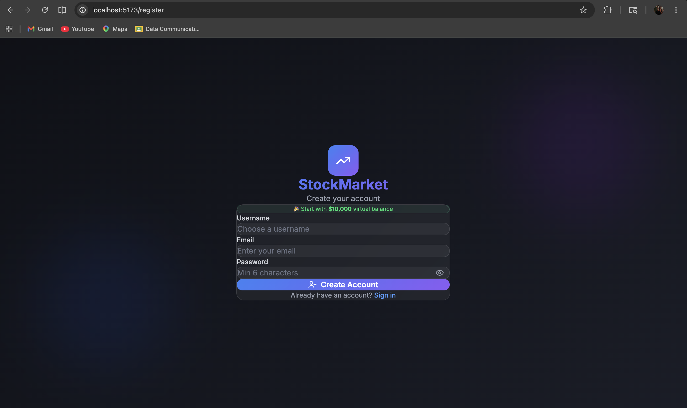
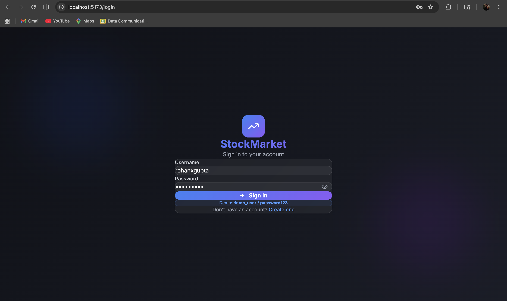
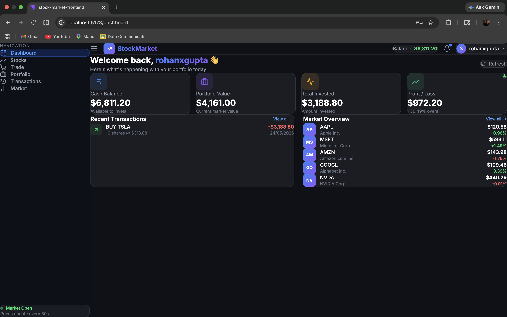
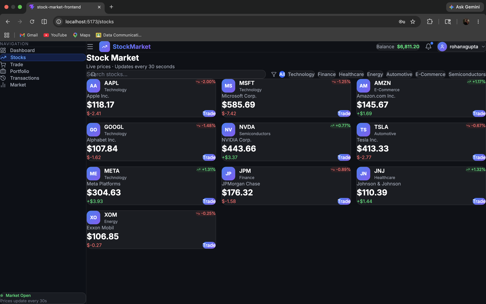
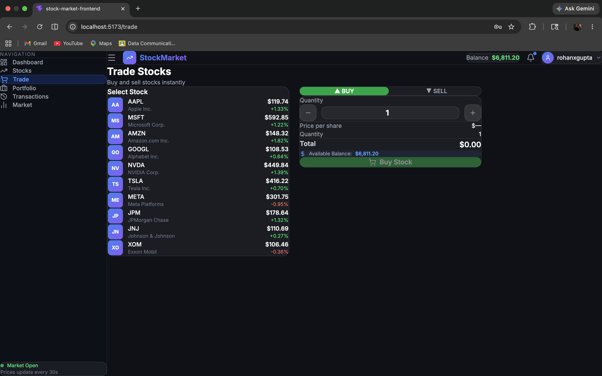
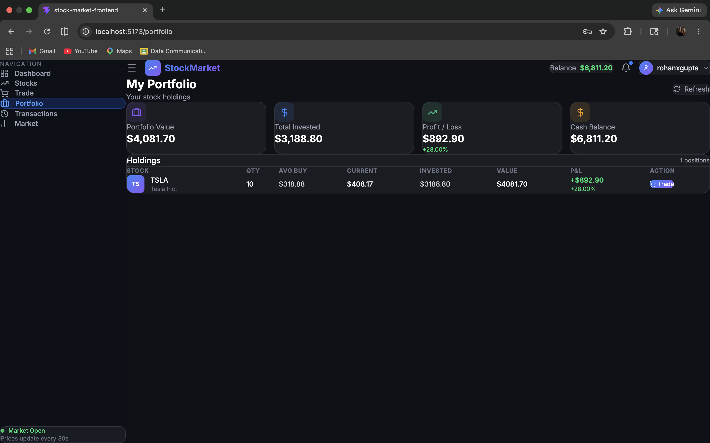
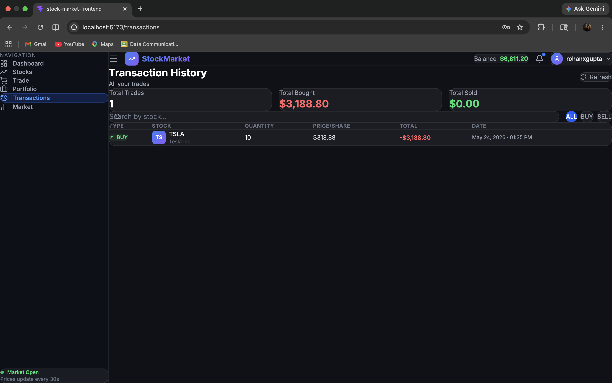

# 📈 Stock Market Management System

<div align="center">


**A full-stack stock market trading simulation platform with real-time price updates, portfolio management, and market analysis.**

[Features](#-features) • [Tech Stack](#-tech-stack) • [Screenshots](#-screenshots) • [Setup](#-installation--setup) • [API](#-api-endpoints)

</div>

---

## 📌 Overview

The **Stock Market Management System** is a production-grade full-stack web application that simulates a real-world stock trading platform. Users can register, log in securely, browse live simulated stock prices, buy and sell shares, manage their investment portfolio, and analyze market trends — all in a risk-free virtual environment.

> 🎯 Built as an academic project demonstrating industry-standard full-stack development practices.

---

## ✨ Features

| Module | Features |
|--------|----------|
| 🔐 **Authentication** | Register, Login, Logout with JWT tokens & BCrypt password hashing |
| 📊 **Dashboard** | Portfolio summary, P&L overview, recent transactions, market overview |
| 📈 **Stock Market** | 10 stocks with live simulated prices updating every 30 seconds |
| 💹 **Trading** | Buy & Sell stocks with balance validation and weighted average pricing |
| 💼 **Portfolio** | Holdings table with invested value, current value, and P&L per stock |
| 📋 **Transactions** | Complete trade history with search and BUY/SELL filter |
| 🔍 **Market Analysis** | Top gainers/losers, price comparison charts, sector distribution |
| 🎨 **UI/UX** | Dark theme, glassmorphism design, fully responsive layout |

---

## 🖥️ Screenshots

### 📝 Register Page


### 🔑 Login Page


### 🏠 Dashboard


### 📈 Stock Market


### 💹 Trade Stocks


### 💼 Portfolio


### 📋 Transaction History


---

## 🛠️ Tech Stack

### Frontend
| Technology | Version | Purpose |
|------------|---------|---------|
| React.js | 18 | UI Framework |
| Vite | 8 | Build Tool |
| Tailwind CSS | 4 | Styling |
| React Router | v6 | Client-side Routing |
| Axios | Latest | HTTP Client |
| Recharts | Latest | Charts & Graphs |
| Lucide React | Latest | Icons |
| React Hot Toast | Latest | Notifications |

### Backend
| Technology | Version | Purpose |
|------------|---------|---------|
| Spring Boot | 3.5.14 | REST API Framework |
| Spring Security | 6 | Authentication & Authorization |
| Spring Data JPA | Latest | ORM |
| Hibernate | 6 | Database Mapping |
| JJWT | 0.11.5 | JWT Token Management |
| BCrypt | - | Password Hashing |
| Maven | 3.9 | Build Tool |

### Database
| Technology | Version | Purpose |
|------------|---------|---------|
| MySQL | 8.0+ | Primary Database |
| InnoDB | - | Storage Engine |

---

## 🗄️ Database Schem
users
├── id (PK)
├── username (UNIQUE)
├── email (UNIQUE)
├── password (BCrypt)
├── balance
└── role
stocks
├── stock_id (PK)
├── stock_symbol (UNIQUE)
├── stock_name
├── current_price
├── previous_price
└── sector
portfolio
├── portfolio_id (PK)
├── user_id (FK)
├── stock_id (FK)
├── quantity
└── average_buy_price
transactions
├── transaction_id (PK)
├── user_id (FK)
├── stock_id (FK)
├── type (BUY/SELL)
├── quantity
├── price_per_share
├── total_value
└── timestamp

## ⚙️ Installation & Setup

### Prerequisites
- Java 17 or 21
- Maven 3.8+
- Node.js 18+
- MySQL 8.0+

### Step 1: Clone the Repository
```bash
git clone https://github.com/rohangupta1258-prog/stock-market-management-system.git
cd stock-market-management-system
```

### Step 2: Setup Database
```bash
mysql -u root -p
CREATE DATABASE stockmarket_db;
EXIT;
```

### Step 3: Configure Backend
Open `stock-market-backend/src/main/resources/application.properties`:
```properties
spring.datasource.username=root
spring.datasource.password=YOUR_MYSQL_PASSWORD
```

### Step 4: Run Backend
```bash
cd stock-market-backend
mvn clean install -DskipTests
mvn spring-boot:run
```
Backend runs at: `http://localhost:8080`

### Step 5: Run Frontend
```bash
cd stock-market-frontend
npm install
npm run dev
```
Frontend runs at: `http://localhost:5173`

### Step 6: Access the App
Open browser → `http://localhost:5173`

**Demo credentials:**
Username: rohanxgupta
Password: Rohan1258

## 🔗 API Endpoints

### Authentication
POST /api/auth/register - Register new user
POST /api/auth/login - Login and get JWT token

### Stocks
GET /api/stocks - Get all stocks
GET /api/stocks/{id} - Get stock by ID
GET /api/stocks/search - Search stocks
GET /api/stocks/gainers - Top 5 gainers
GET /api/stocks/losers - Top 5 losers

### Trading
POST /api/trade/buy - Buy shares (JWT required)
POST /api/trade/sell - Sell shares (JWT required)

### Portfolio & Transactions
GET /api/portfolio - Get portfolio summary (JWT required)
GET /api/transactions - Get all transactions (JWT required)
GET /api/transactions/recent - Get last 5 transactions (JWT required)

---

## 📁 Project Structure
stock-market-management-system/
├── stock-market-backend/
│ └── src/main/java/com/stockmarket/
│ ├── config/ # Security, CORS configuration
│ ├── controller/ # REST API endpoints
│ ├── service/ # Business logic
│ ├── repository/ # Database access
│ ├── model/ # JPA entities
│ ├── dto/ # Data Transfer Objects
│ ├── security/ # JWT filter and utilities
│ └── exception/ # Global exception handling
│
├── stock-market-frontend/
│ └── src/
│ ├── pages/ # Route-level components
│ ├── components/ # Reusable UI components
│ ├── context/ # Global state management
│ ├── services/ # API calls
│ └── index.css # Global styles
│
└── screenshots/ # Application screenshots

---

## 👨‍💻 Author

**Rohan Gupta**

[](mailto:rohangupta1258@gmail.com)
[](https://github.com/rohangupta1258-prog)

---

## 📄 License

This project is built for academic purposes.

---

<div align="center">
⭐ If you found this project helpful, please give it a star!
</div>
